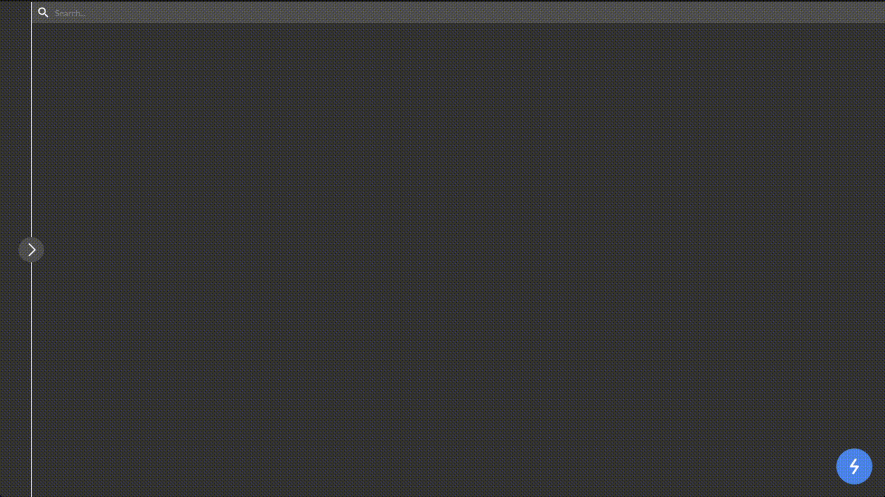
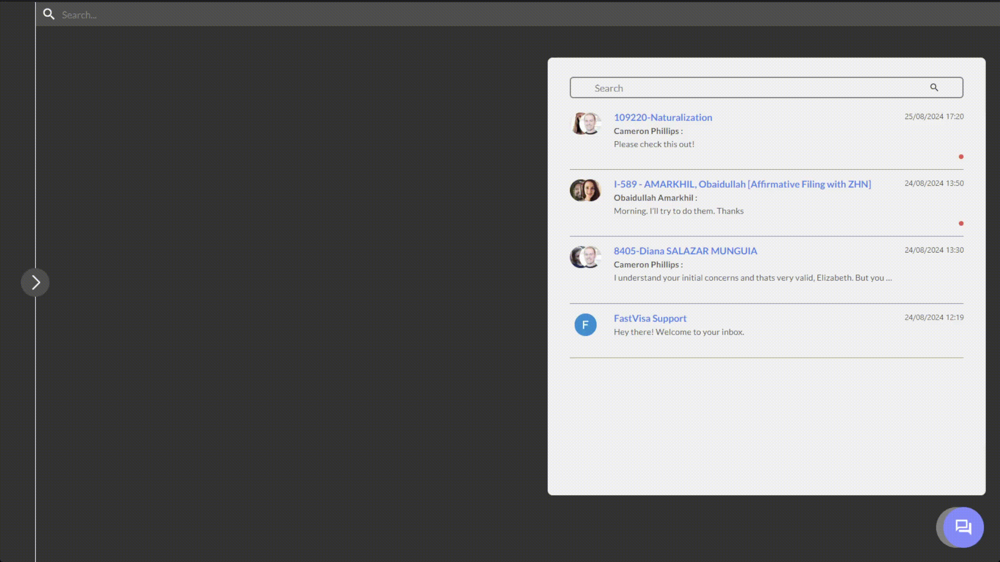
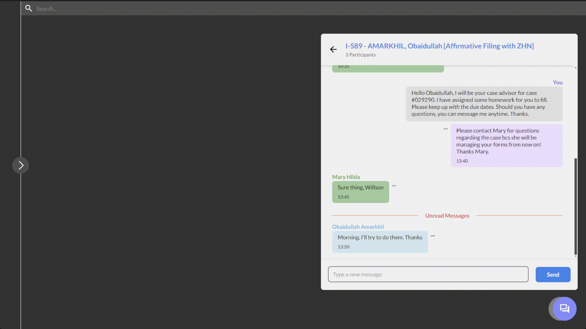
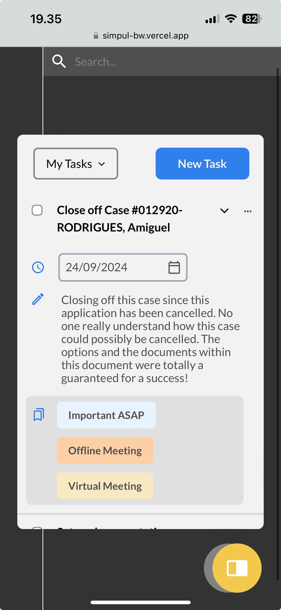
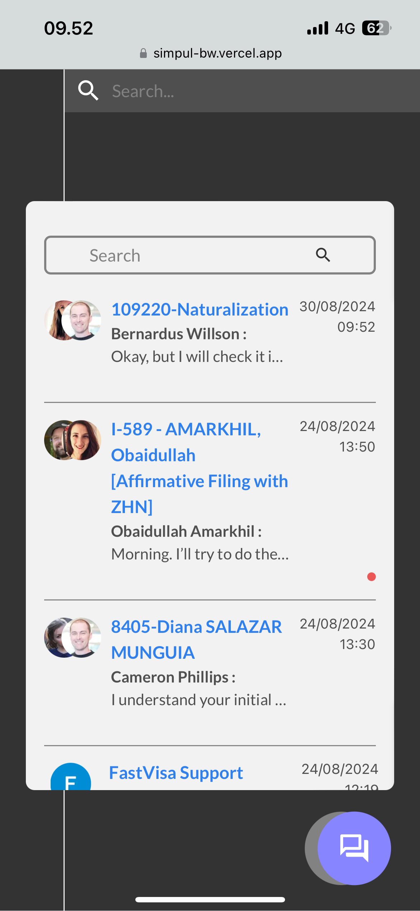
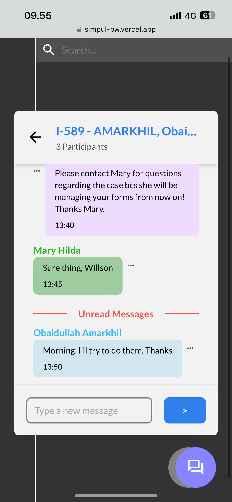

<a id="readme-top"></a>

<!-- PROJECT LOGO -->
<br />
<div align="center">
  

  <h3 align="center">Quicks Frontend Application</h3>

  <p align="center">
    A simple frontend application for skill challenge @ Simpul
    <br />
  </p>
</div>


<!-- TABLE OF CONTENTS -->
<details>
  <summary>Table of Contents</summary>
  <ol>
    <li>
      <a href="#about-the-project">About The Project</a>
      <ul>
        <li><a href="#built-with">Built With</a></li>
      </ul>
    </li>
    <li>
      <a href="#getting-started">Getting Started</a>
      <ul>
        <li><a href="#prerequisites">Prerequisites</a></li>
        <li><a href="#installation">Installation</a></li>
        <li><a href="#run-from-the-deployed-version">Run from the deployed version</a></li>
      </ul>
    </li>
    <li><a href="#contact">Contact</a></li>
  </ol>
</details>


<!-- ABOUT THE PROJECT -->
## About The Project



This frontend application brings to life the "Quicks" pop-up, seamlessly switching between two tools: Messaging and To-Do List. The project focuses on achieving a polished design with smooth functionality and a responsive layout.

<p align="right">(<a href="#readme-top">back to top</a>)</p>


### Built With

* [![Next][Next.js]][Next-url]
* [![React][React.js]][React-url]
* [![Tailwind][Tailwind.css]][Tailwind-url]

<p align="right">(<a href="#readme-top">back to top</a>)</p>


<!-- FEATURES -->
## Features

### Task
- Filter tasks by type

<br></br>
- Add new tasks

<br></br>
- Edit and delete tasks

<br></br>
- Mark tasks as completed

<br></br>
<br></br>

### Inbox
- Go to the chat rooms

<br></br>
- Send messages

<br></br>
- Edit and delete messages

<br></br>
<br></br>

### Reset Data

<br></br>
<br></br>

### Mobile view
<p align="center" style="display: flex; justify-content: center;">
  
  
  
</p>
<br></br>

<!-- GETTING STARTED -->
## Getting Started

### Prerequisites

This project requires the following tools to be installed on your machine:
* npm
  ```sh
  npm install npm@latest -g
  ```

### Installation

1. Clone the repo
   ```sh
   git clone https://github.com/bernarduswillson/simpul-fe.git
   ```
2. Install NPM packages
   ```sh
   npm install
   ```
3. Create a `.env` file in the root directory and add the following line (replace `xxxxxxxx-xxxx-xxxx-xxxx-xxxxxxxxxxxx` with your API Key)
   ```ini
   NEXT_PUBLIC_API_URL=https://simpul-be.vercel.app/api
   NEXT_PUBLIC_API_KEY=xxxxxxxx-xxxx-xxxx-xxxx-xxxxxxxxxxxx
4. Your app is now ready to run!
   ```sh
   npm run dev
   ```
5. Open your browser and go to `http://localhost:3000`


### Run from the deployed version

1. Open your browser and go to `https://simpul-fe.vercel.app/`

<p align="right">(<a href="#readme-top">back to top</a>)</p>

<!-- CONTACT -->
## Contact

Bernardus Willson - bernardus.willson@gmail.com

Project Link: [https://github.com/bernarduswillson/simpul-fe](https://github.com/bernarduswillson/simpul-fe)

<p align="right">(<a href="#readme-top">back to top</a>)</p>


[Next.js]: https://img.shields.io/badge/next.js-000000?style=for-the-badge&logo=nextdotjs&logoColor=white
[Next-url]: https://nextjs.org/
[React.js]: https://img.shields.io/badge/React-20232A?style=for-the-badge&logo=react&logoColor=61DAFB
[React-url]: https://reactjs.org/
[Tailwind.css]: https://img.shields.io/badge/Tailwind_CSS-38B2AC?style=for-the-badge&logo=tailwind-css&logoColor=white
[Tailwind-url]: https://tailwindcss.com/